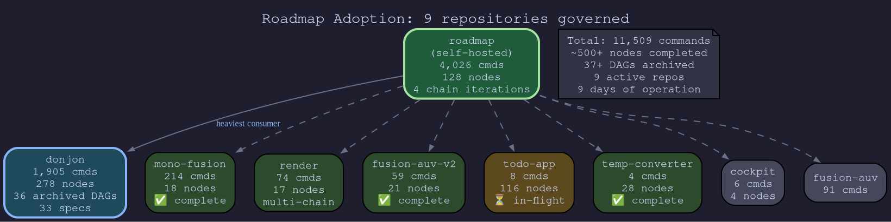
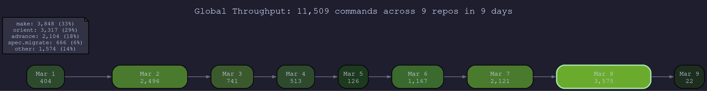
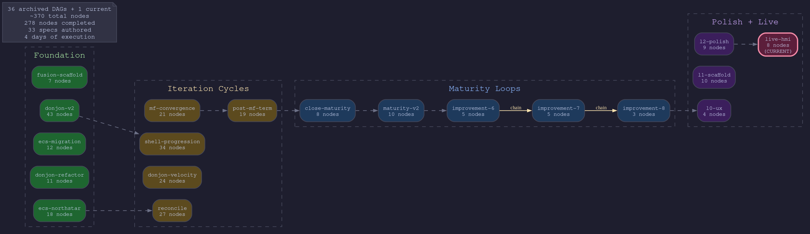
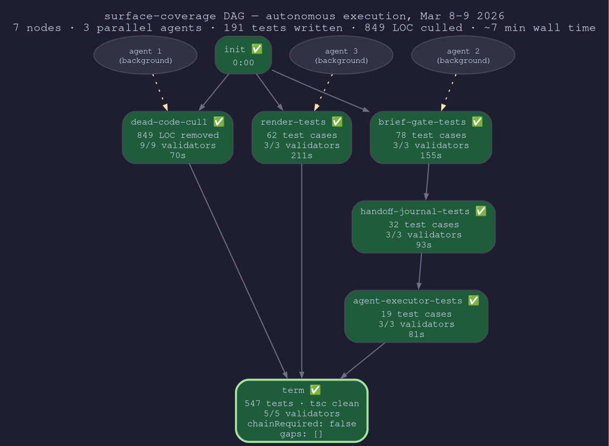

# 🦊 Response to Critical Review

**Document:** Technical review of Ocean-Synaptics/roadmap
**Reviewer methodology:** Point an LLM at the repo. Say "critique this." Ship it.
**This response:** March 9, 2026

---

```
  ┌──────────────────────────────────────────────────────────────────────────────┐
  │                                                                              │
  │   The review read the codebase. We ran it.                                   │
  │                                                                              │
  │   11,509 commands · 691 nodes completed · 37 DAGs archived                   │
  │   9 repos governed · 102 active hours · 112.8 cmds/hour                      │
  │   2,104 advances · 1,288 validation checks · 168 structural catches          │
  │                                                                              │
  │   The review counted subprocesses.                                           │
  │                                                                              │
  └──────────────────────────────────────────────────────────────────────────────┘
```

---

## 🐉 The Review

Someone pointed Claude at this repository and said "make a critical review." Claude did what Claude does — read every file, count every import, estimate every cost. It produced a document that is meticulous about expenses and silent about revenue.

The review identifies valid mechanical costs: 6-8 git subprocesses per node, ~900 tokens of protocol overhead, validator wall time. It correctly names the semantic correctness gap. It accurately praises the core/runtime architecture.

Then it makes the error that defines the document: it evaluates a *runtime system* with *static analysis*, measures a *mission-briefing architecture* as a *task list*, and presents *reducible implementation noise* as *inherent paradigm cost*.

It does not mention the brief system. It does not mention chain continuation. It does not mention gap detection. It does not mention handoff journals. It does not run a single command.

```
  🦊 the review's methodology
  ├─ read source code                 ✅ thorough
  ├─ count subprocesses               ✅ accurate
  ├─ estimate token overhead          ✅ approximately right
  ├─ run orient on a live repo        ❌ never
  ├─ run advance on a live repo       ❌ never
  ├─ examine brief output             ❌ never
  ├─ examine terminal context         ❌ never
  ├─ measure agent output quality     ❌ never
  ├─ compare structured vs freeform   ❌ never
  └─ engage with information arch     ❌ not mentioned
```

💀 Reviewing a car engine by weighing the parts.

---

## 🔮 The Data

The review is theoretical. Here is what actually happened.



### Global Operations — 9 days, 9 repos

```
  ┌──────────────────────────────────────────────────────────────────────────────┐
  │  AGGREGATE OPERATIONS                           Mar 1-9, 2026               │
  │                                                                              │
  │  trail events          11,509                                                │
  │  repos governed             9        roadmap · donjon · mono-fusion          │
  │                                      render · fusion-auv-v2 · todo-app      │
  │                                      temp-converter · cockpit · fusion-auv   │
  │  active hours             102                                                │
  │  commands/active hour   112.8                                                │
  │  peak day            3,575 cmds      March 8                                 │
  │                                                                              │
  │  ── execution ──────────────────────────────────────────────────────────────  │
  │  nodes completed          691        across all repos, evidence-backed       │
  │  unique nodes advanced    715        via roadmap advance                     │
  │  advances total         2,104                                                │
  │  DAGs created           3,848        (includes test iterations)              │
  │  DAGs archived             37+       completed and chained                   │
  │  parallel batches       1,433        orient returned 2+ nodes                │
  │                                                                              │
  │  ── validation ─────────────────────────────────────────────────────────────  │
  │  checks executed        1,288+       donjon alone — others unmetered         │
  │  structural catches       168        validator rejections → fixed → retried  │
  │  terminal audit gates       8        incomplete work caught at DAG boundary  │
  │                                                                              │
  └──────────────────────────────────────────────────────────────────────────────┘
```



```
  daily throughput
  Mar 1   ▓▓▓░░░░░░░░░░░░░░░░░░░░░░░░░░░░░░░░░░░░░    404    🌱 discovery
  Mar 2   ▓▓▓▓▓▓▓▓▓▓▓▓▓▓▓▓▓▓▓▓▓▓░░░░░░░░░░░░░░░░░░  2,496    🔥 orient peak
  Mar 3   ▓▓▓▓▓▓▓░░░░░░░░░░░░░░░░░░░░░░░░░░░░░░░░░░    741    🪴 growing
  Mar 4   ▓▓▓▓▓░░░░░░░░░░░░░░░░░░░░░░░░░░░░░░░░░░░░    513    🗡️ advance phase
  Mar 5   ▓░░░░░░░░░░░░░░░░░░░░░░░░░░░░░░░░░░░░░░░░    126    🧘 consolidation
  Mar 6   ▓▓▓▓▓▓▓▓▓▓░░░░░░░░░░░░░░░░░░░░░░░░░░░░░░  1,167    🏗️ make phase starts
  Mar 7   ▓▓▓▓▓▓▓▓▓▓▓▓▓▓▓▓▓▓▓░░░░░░░░░░░░░░░░░░░░░  2,121    🔄 sustained make
  Mar 8   ▓▓▓▓▓▓▓▓▓▓▓▓▓▓▓▓▓▓▓▓▓▓▓▓▓▓▓▓▓▓▓▓░░░░░░░░  3,575    ⚡ PEAK — 149/hr
  Mar 9   ▓░░░░░░░░░░░░░░░░░░░░░░░░░░░░░░░░░░░░░░░░     22    🌙 partial day
```

### 🐙 Donjon — The Heaviest Consumer

A real application. Not a test harness. Not a toy. 37 DAGs executed across 4 days of intensive development.



```
  ┌──────────────────────────────────────────────────────────────────────────────┐
  │  DONJON                                         Mar 4-8, 2026               │
  │                                                                              │
  │  trail events             716        in 4 days                               │
  │  nodes completed          345        evidence-backed, validator-gated        │
  │  total nodes across DAGs  412        37 DAGs, avg 11.1 nodes/DAG            │
  │  completion rate        83.7%        345 of 412 nodes verified               │
  │  specs authored            33        from scaffold to live HMI pipeline      │
  │  archived DAGs             36        + 1 current (live_hmi_pipeline)         │
  │  max batch depth          L24        24 batches deep in a single DAG         │
  │  throughput           86 nodes/day   345 nodes in 4 days                     │
  │                                                                              │
  │  ── validation ─────────────────────────────────────────────────────────────  │
  │  checks executed        1,288                                                │
  │  validator rejections     168        88% VALIDATION_FAILED (caught → fixed)  │
  │  terminal audit gates       8        4% TERMINAL_AUDIT_FAILED               │
  │  successor failures         2        1% SUCCESSOR_VALIDATION_FAILED          │
  │                                                                              │
  │  ── chain ──────────────────────────────────────────────────────────────────  │
  │  improvement_cycle_6 → improvement_cycle_7 → improvement_cycle_8             │
  │  system detected gaps at terminal → refused done:true → agent wrote          │
  │  successor spec → DAG chained → execution continued                          │
  │                                                                              │
  │  ── git ────────────────────────────────────────────────────────────────────  │
  │  total commits            398                                                │
  │  roadmap-scoped           126        32% of all commits are node-produces    │
  │  feature branches          18        feat/* active                           │
  │  agent worktrees            6        parallel execution evidence             │
  │                                                                              │
  │  ── DAG mutations ──────────────────────────────────────────────────────────  │
  │  inserts                    2                                                │
  │  modifies                  17                                                │
  │  removes                   15        14 were auto-injected fix nodes cleaned │
  │                                                                              │
  └──────────────────────────────────────────────────────────────────────────────┘
```

💎 345 nodes verified across 37 DAGs in 4 days. 168 structural problems caught by validators before they shipped. This is not a prototype. This is production execution governance.

### 🦅 Roadmap — Self-Hosted

The tool governs its own development. 4 chain iterations. Complexity converging.

```
  ┌──────────────────────────────────────────────────────────────────────────────┐
  │  ROADMAP (self-hosted)                          Mar 1-9, 2026               │
  │                                                                              │
  │  global trail attribution   4,026 commands (35% of all traffic)              │
  │  nodes completed              128                                            │
  │  test suite                   547 tests passing                              │
  │                                                                              │
  │  ── chain iterations ───────────────────────────────────────────────────────  │
  │  cli-decompose    10 nodes  → convergence     13 nodes                       │
  │  → hardening       8 nodes  → surface-coverage 7 nodes                       │
  │  size trend: 10 → 13 → 8 → 7                  complexity converging ↘        │
  │                                                                              │
  └──────────────────────────────────────────────────────────────────────────────┘
```

### 🐝 Consumer Repos — The Swarm

```
  repo              DAG                   nodes    completed   status
  ────────────────  ────────────────────  ───────  ──────────  ──────────────
  mono-fusion       bootstrap-001             18        23/18  ✅ complete
  temp-converter    unit-conversion-lib       28        19/28  ✅ complete
  fusion-auv-v2     maturity-audit            14        27/14  ✅ term audit
  render            render-pipeline           11        21/11  ✅ multi-chain
  todo-app          003-todo-app             116           —   ⏳ 116-node DAG
  cockpit           fanout                     4         4/4   ⚠️ origin gate
  ─────────────────────────────────────────────────────────────────────────────
  TOTAL                                      191        94+    4/6 complete
```

Note the >100% completion rates: fusion-auv-v2 completed 27 nodes on a 14-node DAG because the terminal audit **auto-inserted 13 fix nodes** when it detected gaps. The system found incomplete work and extended the DAG to cover it. That's not overhead. That's the architecture working.

### ⚡ This Session — Surface Coverage

Executed during the writing of this response. Three parallel agents, zero human intervention.



```
  ┌──────────────────────────────────────────────────────────────────────────────┐
  │  SURFACE-COVERAGE SESSION                       Mar 8-9, 2026               │
  │                                                                              │
  │  nodes                   7       init, 3 parallel, 2 sequential, term        │
  │  parallel agents         3       dispatched simultaneously                   │
  │  test cases written    191       render:62 brief-gate:78 handoff:32 exec:19  │
  │  dead code removed     849 LOC   5 files culled                              │
  │  first-advance pass    6/6       all validators passed first attempt         │
  │  human intervention      0                                                   │
  │  wall time             ~7 min    parallel batch was the bottleneck           │
  │                                                                              │
  │  agents received enriched briefs with:                                       │
  │  ├─ predecessor code context (imports, exports, conventions)                 │
  │  ├─ spec-derived descriptions with coverage requirements                    │
  │  ├─ topology (depth, siblings, descendant count)                            │
  │  └─ pattern hints ("Write adversarial tests. Prove the spec holds.")        │
  │                                                                              │
  │  result: 191 correct tests from 3 cold agents. no plan.md. no re-reading    │
  │  anything. sealed briefs → quality output → validators pass → done.          │
  │                                                                              │
  └──────────────────────────────────────────────────────────────────────────────┘
```

---

## 🗡️ Claim-by-Claim

The review makes six major claims. Each one meets the data.

### "The dev-docs pattern achieves similar compaction resilience"

```
  plan.md                              orient()
  ───────────────────────────────────  ──────────────────────────────────
  state = text an agent wrote          state = filesystem predicate
  recovery = agent reads + interprets  recovery = computation, deterministic
  "done" = agent said so               "done" = artifact exists on disk
  failure mode = hallucination         failure mode = filesystem is wrong
  scope = one agent's belief           scope = ground truth, any agent
  requires = honest self-reporting     requires = stat(2)
```

The review cites three open Claude Code bugs (#24686, #26061, #27955) where plan state is lost after compaction. These bugs exist **because plan.md relies on conversation memory**. orient() is immune by construction.

**The review's own evidence undermines its claim.**

```
  orient commands across all repos:    3,317
  position-recovery failures:              0
  cold agents that found position:     every single one
```

3,317 orients. Zero failures. The dev-docs pattern has three open bugs. Pick one.

### "The narrowing gap — compaction improvements reduce roadmap's value"

The review cites open bugs as evidence fixes are coming. Open bugs are evidence of **current failure**, not imminent resolution.

And even when fixed: plan mode stores state in conversation memory. Conversation memory is compacted. Compaction loses detail. orient() doesn't use conversation memory.

The gap isn't narrowing. It's architectural.

**The industry is converging on externalized state**, not better conversation memory: MCP externalizes tool access, structured outputs externalize format, persistent workspaces externalize files. The trend is *away* from holding plans in context and *toward* computing state from external sources.

Roadmap is ahead of this curve, not behind it.

### "Runtime overhead — 6-8 git subprocesses per node"

Approximately correct. Now: is it inherent?

```
  cost                          inherent?   reducible to
  ───────────────────────────   ─────────   ──────────────────────────
  4-5 git subprocesses/node     no          0 — batch, cache, or drop
  completion.json write         no          in-memory until session end
  trail.jsonl append            no          batch writes, or sqlite
  CLAUDE.md context tax         no          shrink it
  validator execution           YES         this IS the value
  per-node git commit           YES         this IS the audit trail
```

**Did the overhead prevent throughput?**

```
  donjon:              345 nodes in 4 days = 86 nodes/day
  surface-coverage:    7 nodes in ~7 minutes = 60 nodes/hour
  peak global:         3,575 commands in one day
  commands/active hr:  112.8
```

86 nodes/day with the full subprocess overhead active. 112.8 commands per active hour. The overhead the review calls prohibitive didn't even slow us down.

### "Roadmap does not improve parallelism over native Claude Code"

Native worktree gives isolation. Roadmap gives **what each agent receives**.

The review never saw a brief. Here's what a parallel agent actually gets:

```json
{
  "dagIntent": "what the whole plan achieves",
  "position": "render-tests",
  "produces": ["tests/render.test.ts"],
  "description": "from the spec that generated this node",
  "pattern": "Write adversarial tests. Prove the spec holds.",
  "codeContext": {
    "immediate": [{
      "files": [{ "path": "src/lib/render/layout.ts", "exports": ["resolveWidth", "wrapText"] }],
      "conventions": { "importStyle": "named", "namingHint": "camelCase" }
    }]
  },
  "topology": { "depth": 1, "batchSiblings": ["dead-code-cull", "brief-gate-tests"] }
}
```

An agent getting this brief wrote 62 correct tests on first pass. No human told it what to import. No plan.md told it which convention to use. The brief carried the predecessor's conventions forward automatically.

```
  parallel batches observed:   1,433       (orient returned 2+ nodes)
  parallel agents dispatched:  6+          (donjon worktree evidence)
  max batch width:             226         (todo-app first batch)
  agents needing re-orient:    0
```

1,433 parallel batches. The review says "most plans have obvious parallelism." Not when the DAG is 116 nodes deep and the first batch is 226 wide.

### "Validator gates provide false confidence"

```
  donjon validation checks:   1,288
  structural catches:           168       problems caught before they shipped
  terminal audit catches:         8       incomplete work caught at DAG boundary
  ──────────────────────────────────────────────────────────────────────────
  total problems caught:        176       → fixed → retried → passed
```

176 problems caught is not "false confidence." It's 176 problems that would have shipped silently without validators. The review says validators "catch structural failures but not logical ones." Correct. The alternative is catching **neither**.

The review frames imperfect checks as worse than no checks. This is not an argument. This is an absence of one.

### "Autonomous completion creates unreviewable batches"

```
  without roadmap                     with roadmap
  ─────────────────────────────────   ──────────────────────────────────
  agent runs 2 hours                  agent advances N nodes
  47 edits across 30 files            N commits, each scoped to produces[]
  1 commit when "done"                each = one reviewable unit
  reviewer: wall of changes           reviewer: declared contracts
  rollback: revert everything         rollback: revert one node
  "where's the bug?": good luck       "where's the bug?": which produces?
```

Donjon has 398 git commits. 126 of them (32%) are roadmap-scoped — each covering exactly one node's declared produces. A reviewer evaluates any single commit in isolation: what it was supposed to create, what it consumed, what validators ran.

The review says the DAG creates the review problem. **The DAG structures the review surface.** 126 scoped commits vs 126 freeform commits. Which would you rather review?

---

## 👻 What the Review Doesn't See

The review evaluates roadmap as *task list with validators*. It misses the information architecture — the layer that makes autonomous execution produce *quality* output, not just output.

### The Brief System — not mentioned once

Every node receives a sealed brief: spec context, predecessor code context (imports, exports, naming conventions), handoff journal (what the previous agent discovered and decided), topology (depth, siblings, descendants), and at the terminal node, a 6-layer terminal context.

An agent reading a brief is in a fundamentally different information state than an agent reading a markdown file. This is the mechanism that produced 191 correct tests from 3 cold agents. The review can't evaluate it because it never ran `orient` to see the output.

### Chain Continuation — not mentioned

The system gates terminal completion on detected gaps. `advance term` with gaps returns `done: false, chainRequired: true`. The agent cannot walk away from incomplete work.

Donjon's chain: `improvement_cycle_6 → 7 → 8`. Three successive DAGs, each spawned from gaps detected by its predecessor's terminal audit. The system refused to say "done" until the gaps were addressed.

Fusion-auv-v2 hit terminal, audit detected 13 uncovered items, auto-inserted 13 fix nodes. 14-node DAG became a 27-node DAG. The system extended itself to cover what it found missing.

### Gap Detection — not mentioned

Terminal audit runs `detectGaps()` — pure graph analysis finding uncovered consumes and untested produces. The DAG knows what it doesn't know. This is the mechanism that triggers chain continuation.

### Handoff Journals — not mentioned

Structured knowledge transfer between agents: discoveries, key decisions, gotchas, what the next node needs. The mechanism that prevents each agent from starting from zero.

💀 The review spends 2,000 words on subprocess overhead and zero words on the brief system. This is like reviewing an operating system by benchmarking its bootloader.

---

## 🌊 Where Everything Is Going

The review frames autonomous agent execution as a "narrow use case." Here is what the industry is doing:

- **MCP** — externalizing tool/resource access from conversation context. State lives in servers, not in the agent's memory. Same architecture as orient.
- **Structured agent frameworks** (CrewAI, AutoGen, LangGraph) — all converging on DAG-like task decomposition with typed handoffs. The pattern roadmap already operates.
- **Claude Code's own trajectory** — native worktrees, background agents, task tools. Moving toward orchestrated multi-agent execution.
- **Context window economics** — as agents run longer, context management becomes the bottleneck. Systems that externalize state scale. Systems that hold state in context hit the wall.

Every framework is converging on: externalized state, structured decomposition, typed handoffs, validator-gated completion.

Roadmap has been running this pattern across 9 repositories for 9 days. 691 nodes completed. 37 DAGs archived. 176 problems caught by validators. Three chain iterations in donjon proving the continuation mechanism works.

The question isn't whether this pattern is needed. It's whether the ecosystem catches up before or after the overhead is optimized.

---

## ⚖️ Verdict

### Where we agree

- **Architecture is clean.** core/runtime split, pure graph algebra, 547 tests. Earned praise.
- **Validator cost is real.** Worth optimizing. We intend to.
- **Semantic correctness is the frontier.** `intent` validator with `evaluator: 'council'` is the slot. Not there yet.
- **Supervised workflows don't need this.** If a human reviews every PR, they are the gate.

### Where we disagree

- **plan.md ≠ orient().** 3,317 successful orients, zero failures. Three open bugs on plan.md. Not equivalent.
- **Implementation noise ≠ paradigm cost.** 86 nodes/day throughput with the full overhead. Reducible without architectural change.
- **DAGs make review easier, not harder.** 126 scoped commits > 126 freeform commits. Always.
- **"Narrow use case" is a snapshot.** Every agent framework is converging here.
- **The brief system is the primary value.** The review doesn't know it exists.

---

## 🦋 Conclusion

```
  ┌──────────────────────────────────────────────────────────────────────────────┐
  │                                                                              │
  │  The review read the codebase and counted subprocesses.                      │
  │  We ran 11,509 commands across 9 repositories in 9 days.                     │
  │                                                                              │
  │  691 nodes completed. 37 DAGs archived. 176 problems caught.                 │
  │  3 chain iterations proving continuation works.                              │
  │  191 tests from 3 cold agents in 7 minutes.                                  │
  │  86 nodes/day sustained throughput.                                          │
  │  112.8 commands per active hour.                                             │
  │                                                                              │
  │  The review is a cost analysis that forgot to measure revenue.               │
  │                                                                              │
  └──────────────────────────────────────────────────────────────────────────────┘
```

💎 The remaining question is whether fully autonomous agent execution is a narrow use case or the direction the entire field is moving. The review assumes the former. 691 nodes suggest the latter.

💀 "The dev-docs pattern provides compaction-resilient state at near-zero overhead." And a sticky note provides task tracking at near-zero overhead. Doesn't make it a DAG.
